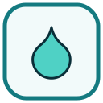
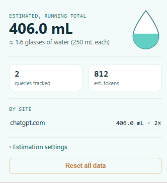

<p align="center">
  
</p>

<h1 align="center">AI Water Footprint Tracker</h1>

A Chrome extension that estimates the water used by your AI chatbot conversations — on any AI site, no configuration needed — and tallies a running total in your toolbar.

<p align="center">
  
</p>

## What it does

- Detects when you send a message on any AI chat site (ChatGPT, Claude, Gemini, or others) using generic heuristics — no site-specific integration required.
- Estimates a rough token count from the length of your message and the reply.
- Applies an editable "mL per 1,000 tokens" figure to estimate water usage.
- Shows a running total, a per-site breakdown, and a filling water-droplet graphic in the popup.

## ⚠️ A note on accuracy

The actual water cost of an AI query is **genuinely contested** — it varies enormously by model, hardware, and data center cooling method, and public estimates differ by orders of magnitude. This extension gives you a **consistent, adjustable estimate**, not a measured fact. The conversion constant is editable in the popup's settings precisely because there's no single agreed-upon number — treat the total as directional, not authoritative.

Detection is also heuristic by nature, since it works generically across sites rather than targeting one chat UI specifically. It may occasionally miss a message or double-count on sites with unusual input patterns.

## Installation (no Chrome Web Store needed)

1. Click **Code → Download ZIP** on this repo (or clone it).
2. Unzip it.
3. Open Chrome and go to `chrome://extensions`.
4. Turn on **Developer mode** (top-right toggle).
5. Click **Load unpacked** and select the unzipped folder (the one containing `manifest.json` directly inside it).
6. Pin the droplet icon to your toolbar via the puzzle-piece menu.


## Privacy

- All data stays on your device in `chrome.storage.local`. Nothing is sent to any server.
- The extension does not transmit page content, message text, or browsing activity anywhere.
- You can clear all tracked data anytime via the "Reset all data" button in the popup.

## Project structure

```
water-usage-extension/
├── manifest.json     — extension configuration
├── background.js      — aggregates usage into storage
├── content.js          — detects submissions & responses on any page
├── popup.html           — toolbar popup markup
├── popup.css             — popup styling
├── popup.js               — popup logic
└── icons/                  — toolbar icons (droplet, via Lucide, ISC license)
```

## License

Feel free to fork, modify, and reuse. The droplet icon is based on [Lucide Icons](https://lucide.dev) (ISC License).
